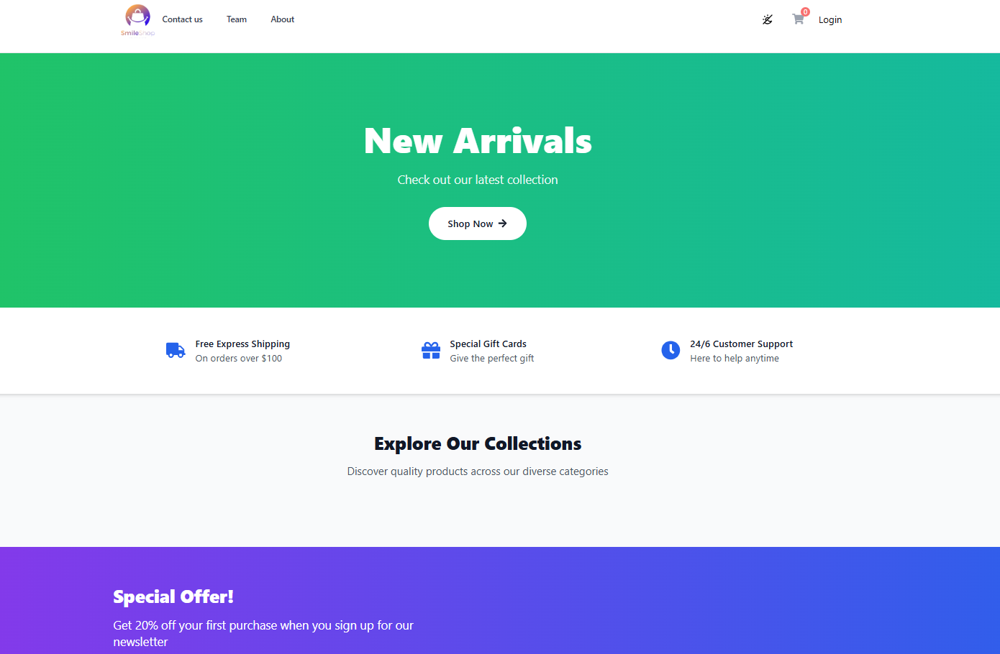
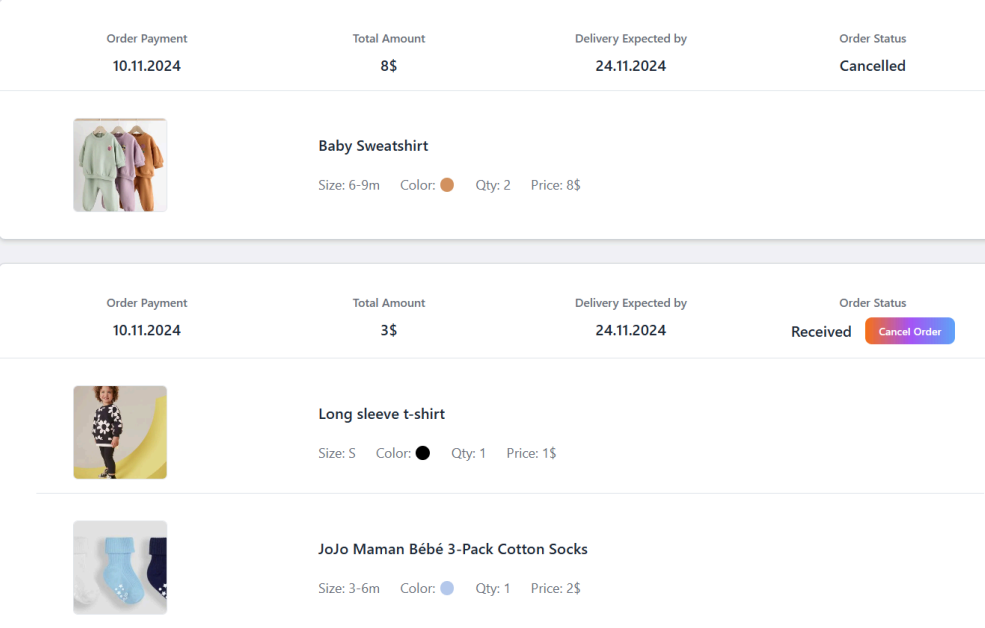
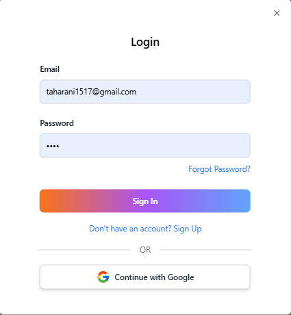

# Next.js Full-Stack E-Commerce Project

## Overview
Full-stack eCommerce application built with **Next.js**, **Prisma**, and **NextAuth**.  
Features a responsive frontend, API routes for backend logic, database integration, and user authentication.

This project demonstrates my skills in building **end-to-end web applications**, clean architecture, and modern web technologies.

---

## Tech Stack
- **Frontend:** Next.js, React, Tailwind CSS  
- **Backend:** Next.js API Routes, Prisma ORM  
- **Database:** PostgreSQL / MySQL / SQLite  
- **Authentication:** NextAuth (JWT)  
- **Tools:** Git, GitHub, Postman

---

## Features
- User authentication & authorization using NextAuth  
- Role-based access control (planned or implemented)  
- CRUD operations for products using Prisma  
- Responsive and clean UI built with React and Tailwind  
- API routes for frontend-backend communication  
- Database integration for persistent storage

---

## Architecture
- Frontend components located in `app` directory (Next.js / React)  
- Backend logic organized through API routes connected to Prisma for DB access  
- Planned separation: **Controllers → Services → Prisma queries** for clean architecture

---

## How to Run
1. Clone the repository:  
   ```bash
   git clone https://github.com/SaraTaharani/eCommerce-Project.git

2. Navigate to the project folder:
   ```bash
    cd my-app

3. Install dependencies:
   ```bash
   npm install

4. Generate Prisma client:
   ```bash
   npx prisma generate

5. Run the development server:
   ```bash
   npm run dev

6. Open http://localhost:3000
 in your browser

## Notes

- Backend fully integrated with Prisma
- Authentication handled by NextAuth
- Database schema defined in `prisma/schema.prisma`
- Currently includes full frontend + backend; future enhancements may include additional features like cart/checkout workflows

---

## Screenshots

### Home Page


### Product List


### Login


---

## Learnings & Skills Demonstrated

- Full-stack development with modern frameworks
- End-to-end API integration
- User authentication & role management
- Database modeling and ORM usage
- Responsive frontend design and UX
